# karzat

**Every recorded vote of the Hungarian Parliament since 1990 — one page per vote, drawn
seat by seat, with the majority rule the House itself applied.**

**Live: [ogykarzat.hu](https://ogykarzat.hu)** — in Hungarian, because its audience is the
Hungarian public. This document is for the people who want to see how it is built.

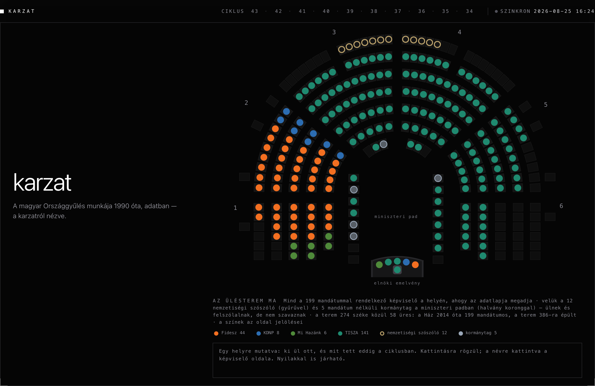

## What you can see

**One vote, one page.** Every vote since 1990 has its own address: the seat chart, the
tally, the majority rule that applied, and the full roll call — sortable, filterable,
downloadable. The site recomputes every verdict from the raw positions and says so when it
disagrees with the source.
[→ a vote page](https://ogykarzat.hu/ckl43/szavazas/2026-07-28T10-35-33.html)

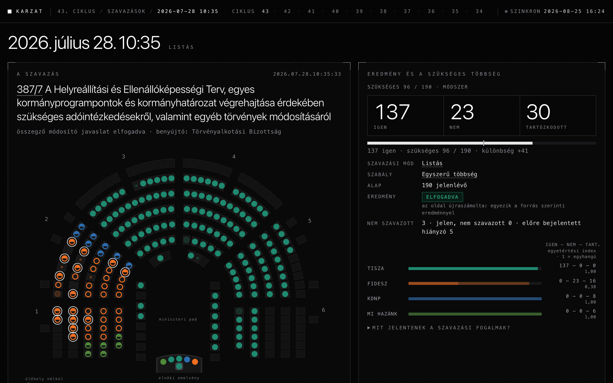

**The chamber answers the cursor.** Point at any seat: who sits there, and what they have
done this cycle. The legend filters one faction. Everything works by keyboard too, and the
page is complete without JavaScript.
[→ ogykarzat.hu](https://ogykarzat.hu)

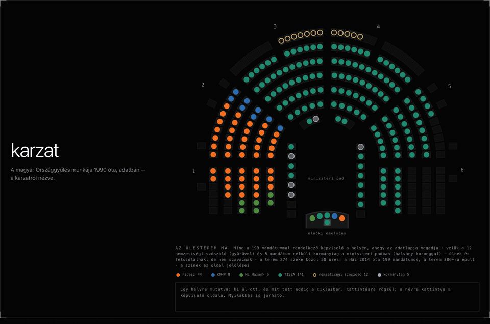

**A career on one axis.** Every person who ever held a mandate since 1990 has a page:
mandates, factions, per-cycle voting record, committees, submissions.
[→ a career page](https://ogykarzat.hu/szemely/a011.html)

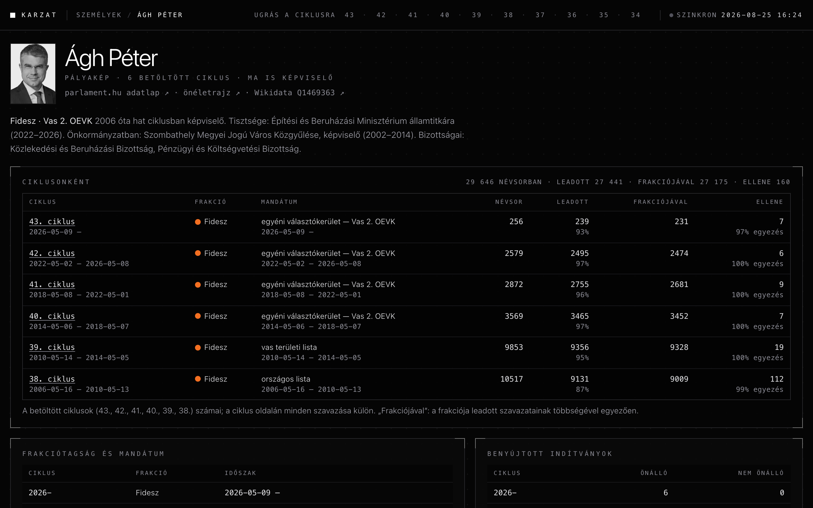

**Charts that answer precisely.** The monthly series reads out the exact figure under the
cursor; a month opens into the full list of its votes. No number on the site exists only
as pixels.
[→ the numbers](https://ogykarzat.hu/ckl43/szamok/index.html)

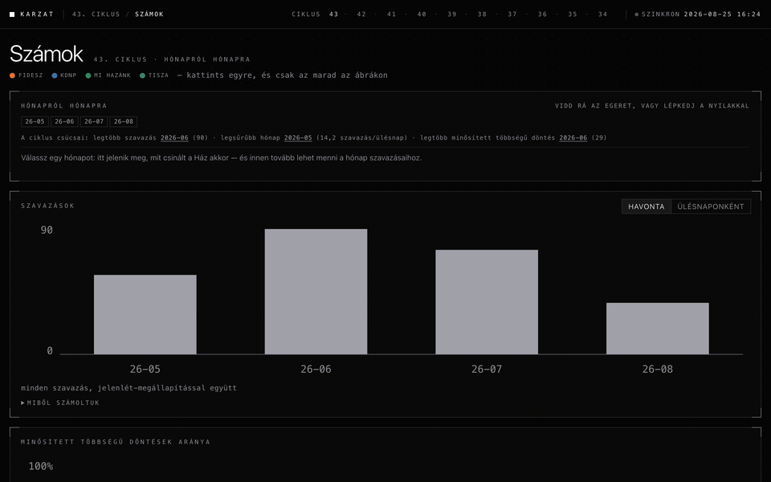

**Search what was actually said.** The verbatim floor record, prefix-searchable in the
browser — no server, the index ships as static shards.
[→ the speech search](https://ogykarzat.hu/ckl43/felszolalas/kereses.html)

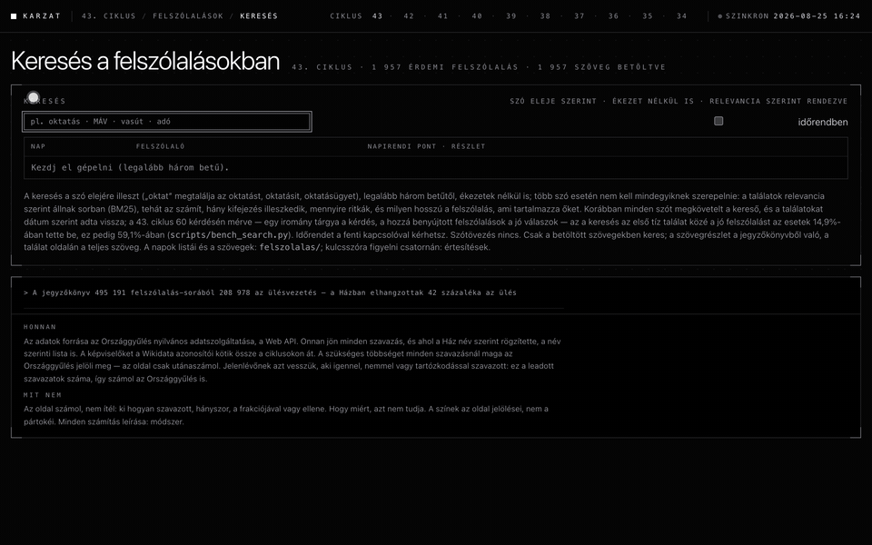

## For the citizen

**Who is my MP?** A postcode is the sharpest thing most people know about where they live. Type
one and the page walks it to the constituency and the member — and where a city is split
street by street, it says so rather than guessing.
[→ Ki a képviselőm?](https://ogykarzat.hu/ckl43/kepviselom/index.html)

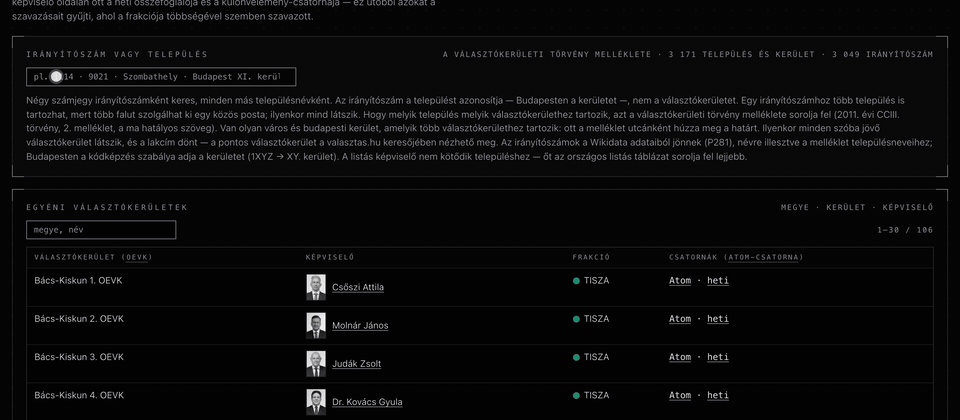

**Alerts, as feeds rather than a mailing list.** Every vote where a member broke with their own
faction is an Atom channel — for the whole House, for one faction, or for one member. So are the
weekly digests, the verbatim speech stream, and the committee invitations. No account, no
tracking, no summarising: your reader gets the record, and the filtering is yours.
[→ Értesítések](https://ogykarzat.hu/ckl43/feed/index.html)

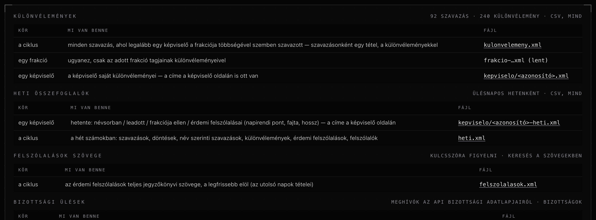

**What the House is paid.** Every member's stated gross for the month the datasheet publishes,
in one sortable table, with the statute's own multipliers printed only where the arithmetic lands
on them to the forint. Offices are shown as information, never as explanation.
[→ Javadalmazás](https://ogykarzat.hu/ckl43/javadalmazas/index.html)

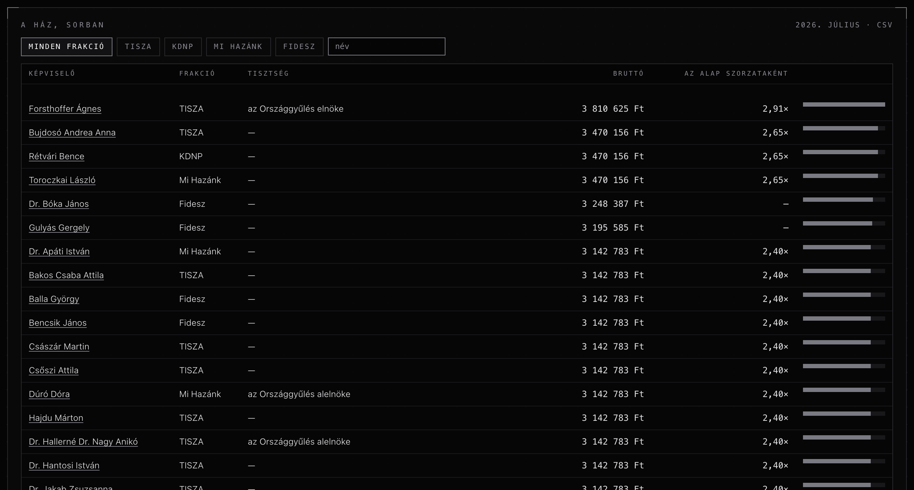

## For the analyst

**One axis, and the parliament it does not fit.** Factions placed on a single line estimated from
the votes alone — with the fit stated, the spread of each faction drawn, and the warning that the
numbers mean nothing outside their own chart.
[→ Kohézió](https://ogykarzat.hu/ckl43/kohezio/index.html)

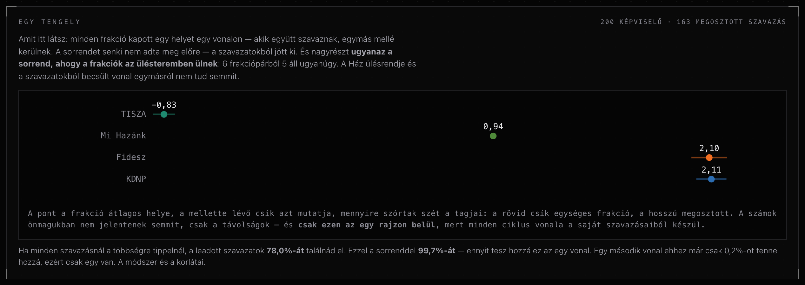

**Where the absences decided.** Every decision measured against the threshold it needed, and the
counterfactual named as a counterfactual: what would have happened if everyone on the roll had
voted with their faction.
[→ Szoros szavazások](https://ogykarzat.hu/ckl38/szoros/index.html)

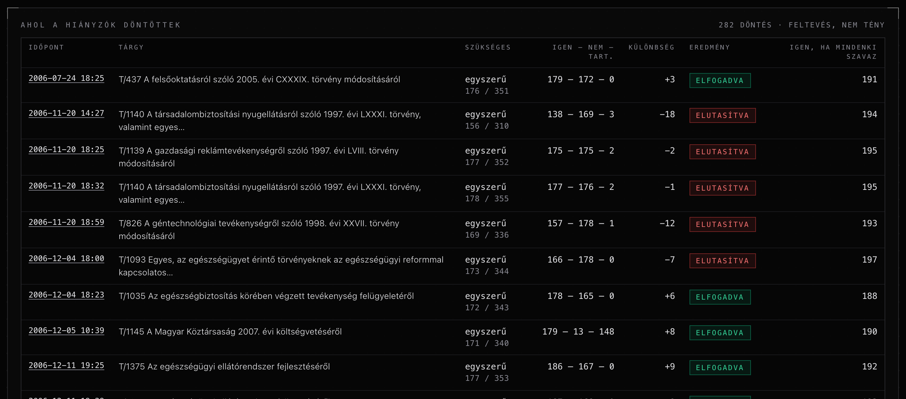

**Where the House's time went.** Speaking time by debate, by faction, by kind, by stage — and by
person, ranked, filterable, with the caveat that a leader's slot and a backbencher's are different
roles rather than different diligence.
[→ Beszédidő](https://ogykarzat.hu/ckl43/beszedido/index.html)

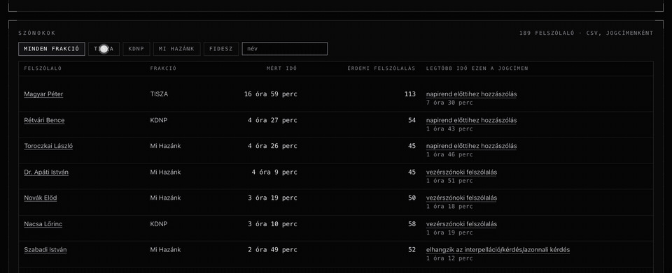

**Passages that turn up in more than one mouth.** Text repeated word for word by two different
members: how many words, who, and how much later.
[→ Visszhang](https://ogykarzat.hu/ckl43/visszhang/index.html)

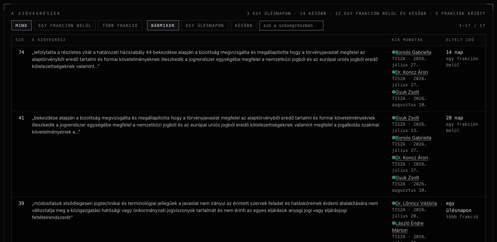

## For the researcher

**SQL over the whole corpus, in your own browser.** Eight Parquet files and DuckDB-WASM: the
query runs on your machine, nothing is uploaded, and the result draws itself. Seventeen million
voting positions grouped in about five seconds on a laptop.
[→ Riport](https://ogykarzat.hu/riport/index.html)

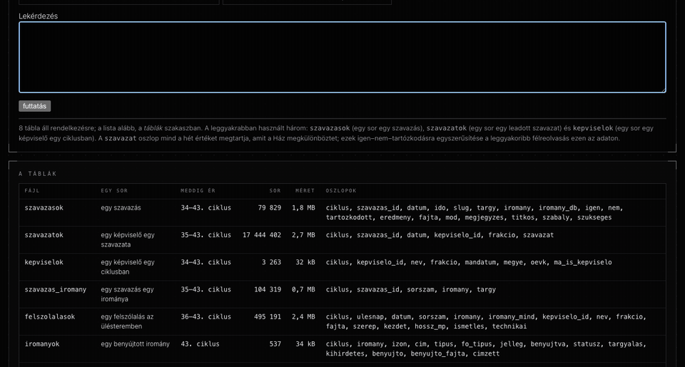

Every table the site draws is also a download — per-cycle CSV and JSON under `adatok/`, the whole
corpus as Parquet — and each build writes a receipt that hashes what it read, so a number can be
traced to the payload it came from.

## Where the record stops

The most important page is the one that draws the edge of what can be known: month by month since
1990, where the record names every member and where it only counts them, which days the source's
own 400-row cap truncated, and which of those can never be recovered. A site that only showed what
it has would be quietly claiming the rest does not exist.
[→ Ameddig a jegyzőkönyv elér](https://ogykarzat.hu/lefedettseg/index.html)

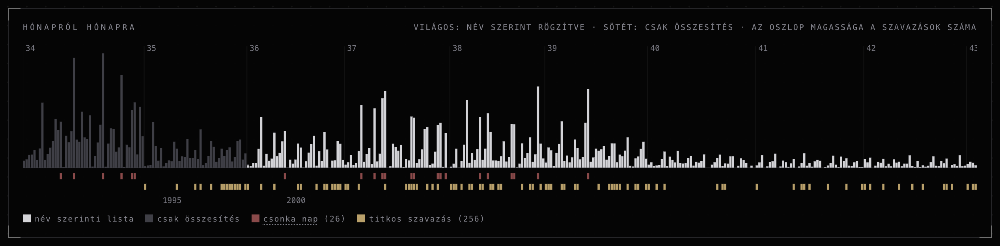

## The record it stands on

| | |
|---|---|
| Recorded votes, 1990 → today | **79,829** |
| Roll calls naming every member | **49,771** |
| Individual voting positions | **17,444,402** |
| Unresolved names among them | **0** |
| People who ever held a mandate | **1,602** |
| Floor speeches indexed | **495,191** |
| Sitting days | **1,858** |
| Offline tests guarding all of it | **474** |

Every number in this table — and every number in this repository's prose — is recomputed
by `scripts/check_readme.py` and the test suite fails when the text and the data disagree.
Nothing numeric in this file is typed by hand.

## How it holds

- **One source.** The Országgyűlés's own Web API. No scraping, no third parties, no
  cookies, no analytics. Every figure carries its provenance.
- **Static all the way down.** One Python builder renders the whole site as files.
  What you see needs no server and no JavaScript; scripts only add speed and comfort.
- **Gates before publish.** The full test suite (link resolution across every internal
  reference included), this README's number gate, and an axe-core accessibility audit run
  between build and deploy. A failure leaves the old site live: a stale site is a smaller
  harm than a wrong one.
- **The site counts, it does not judge.** Seven distinct recorded positions are never
  collapsed. A tie is no plurality. What the record does not say, the page does not say.

## Run it

```bash
python3 -m scripts.build_site      # data/derived + config → the whole site under site/
python3 -m unittest discover -s tests -t .
python3 -m scripts.check_readme    # the number gate over this file and the log
```

The derived inputs are committed, so a clone builds the full site offline. Live syncing
needs your own (free) parlament.hu API token — see `.env.example`.

## Everything else it does

| | |
|---|---|
| [The law's path](https://ogykarzat.hu/ckl43/iromany/index.html) | Every motion with its lifecycle events, the votes taken on it, and its promulgation — from the register's own datasheets |
| [The House's profile](https://ogykarzat.hu/arcel/index.html) | Cycle by cycle: who sits for the first time, and what the record states about degrees, languages and local-government pasts |
| [Faction switches](https://ogykarzat.hu/frakciovaltas/index.html) | Every mid-mandate switch since 1990, and whether the two registries tell the same story about it |
| [Committees](https://ogykarzat.hu/ckl43/bizottsag/index.html) | Membership per cycle, reconstructed from the members' own records where the API gives only the present |
| [Sitting days](https://ogykarzat.hu/ckl43/felszolalas/index.html) | One page per day: the votes, the speeches, and the citation block for quoting any of it |
| [Weekly digests](https://ogykarzat.hu/ckl43/feed/heti.xml) | Per member and per cycle: on the roll, cast, against their faction, substantive speeches |
| [Search](https://ogykarzat.hu/kereses/index.html) | Members, careers and motions across every cycle, accent-folded, in one box |
| [Method and data](https://ogykarzat.hu/modszer/index.html) | Every rule and every calculation written out, with the downloads beside them |
| Career pages | One per person who ever held a mandate, with per-cycle records and cross-cycle history |
| Vote exports | Every vote also as JSON and CSV, at the same address as its page |

## Licence

| Layer | Licence |
|---|---|
| Code (this repository) | MIT |
| The parliamentary record | The House's own; no rights conveyed — register your own token |
| Derived data (`data/derived/`) | CC BY 4.0 |
| Member portraits | Served as reduced greyscale copies; status documented on the method page |

## The whole story

The build log — every decision, every correction, every bug with its name on it, in the
order they happened — is a separate, long read:
**[docs/ENGINEERING.md](docs/ENGINEERING.md)**.
